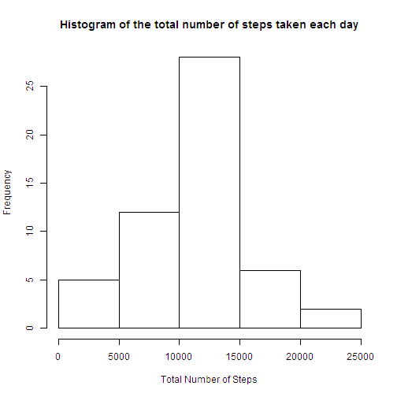
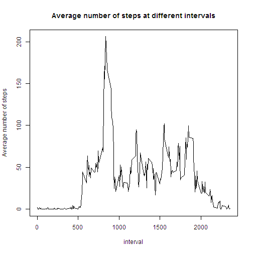
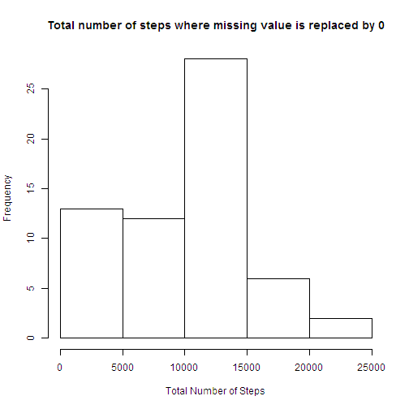
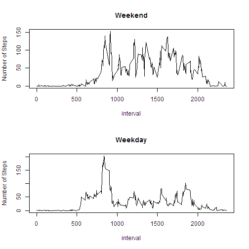

# Reproducible Research: Peer Assessment 1
========================================================

## Loading and preprocessing the data

```r
monitor <- read.csv("activity.csv")
```

## What is mean total number of steps taken per day? 
For this part of the assignment, you can ignore the missing values in the dataset.  

1.Make a histogram of the total number of steps taken each day

```r
monitor$date <- as.Date(monitor$date)
monitor_SumbyDate <- tapply(monitor$steps, monitor$date, sum)
library(datasets)
hist(monitor_SumbyDate,
     main ="Histogram of the total number of steps taken each day",
     xlab = "Total Number of Steps", ylab = "Frequency")
```

 

2.Calculate and report the mean and median total number of steps taken per day

```r
mean(monitor_SumbyDate, na.rm = TRUE) #compute Mean
```

```
## [1] 10766
```

```r
median(monitor_SumbyDate, na.rm = TRUE) #compute Medain
```

```
## [1] 10765
```

## What is the average daily activity pattern?

1.Make a time series plot (i.e. type = "l") of the 5-minute interval (x-axis) 
and the average number of steps taken, averaged across all days (y-axis)

```r
library(reshape2)
AvgStepsInterval <- melt(tapply(monitor$steps, monitor$interval, mean, 
                                na.rm = TRUE))
with(AvgStepsInterval, plot(Var1, value, type = "l", 
    main = "Average number of steps at different intervals", 
    xlab = "interval", ylab = "Average number of steps" ))
```

 

2.Which 5-minute interval, on average across all the days in the dataset, contains the maximum number of steps?

```r
#this will return the interval containing the maximun number of steps
AvgStepsInterval[which.max(AvgStepsInterval$value),1] 
```

```
## [1] 835
```

## Imputing missing values

Note that there are a number of days/intervals where there are missing values (coded as NA). The presence of missing days may introduce bias into some calculations or summaries of the data.  

1.Calculate and report the total number of missing values in the dataset (i.e. the total number of rows with NAs).


```r
sum(is.na(monitor$steps)) #check on how many NA values in monitor$steps
```

```
## [1] 2304
```

2.Devise a strategy for filling in all of the missing values in the dataset. The strategy does not need to be sophisticated. For example, you could use the mean/median for that day, or the mean for that 5-minute interval, etc. 
- **For this case, we will fill the missing value with zero**

3.Create a new dataset that is equal to the original dataset but with the missing data filled in. For this case, we replace the missing value with zero.

```r
monitor2 <- monitor            #create a new the data frame
monitor2[is.na(monitor2)] <- 0 #set missing value to zero
```

4.Make a histogram of the total number of steps taken each day,


```r
monitor2_SumbyDate <- tapply(monitor2$steps, monitor2$date, sum)
hist(monitor2_SumbyDate,
     main ="Total number of steps where missing value is replaced by 0",
     xlab = "Total Number of Steps", ylab = "Frequency")
```

 

and Calculate and report the mean and median total number of steps taken per day.


```r
mean(monitor2_SumbyDate) #compute mean
```

```
## [1] 9354
```

```r
median(monitor2_SumbyDate) #compute median
```

```
## [1] 10395
```

Do these values differ from the estimates from the first part of the assignment? 
- **Yes**

What is the impact of imputing missing data on the estimates of the total daily number of steps?
- **It shows that the frequency of the steps between 0 to 10,000 is higher when replacing the missing value and the mean and median total number of steps are lower than the original data**

## Are there differences in activity patterns between weekdays and weekends?

1.Create a new factor variable in the dataset with two levels - "weekday" and "weekend" indicating whether a given date is a weekday or weekend day.
- Creat a new column in the data frame containing "weekday" or "weekend". 

```r
monitor2$weekdays <- c(" ")
for (i in 1:nrow(monitor2)){
    if(weekdays(monitor2[i,2]) == "Saturday" | weekdays(monitor2[i,2]) == "Sunday"){
        monitor2[i,4] <- "weekend"
    }
    else{
        monitor2[i,4] <- "weekday"
    }
}
```

- Separate data frame in 2 subsets, one is for weekday and one is for weekend.

```r
monitor2_weekday <- subset(monitor2, weekdays == "weekday")
monitor2_weekend <- subset(monitor2, weekdays == "weekend")
AvgSteps_Weekday <- melt(with(monitor2_weekday, tapply(steps,interval, mean)))
AvgSteps_Weekend <- melt(with(monitor2_weekend, tapply(steps,interval, mean)))
```

2.Make a panel plot containing a time series plot (i.e. type = "l") if the 5-minute interval (x-axis) and the average number of steps taken, averaged across all weekday days or weekend days (y-axis).


```r
par(mfrow = c(2,1))
plot(AvgSteps_Weekend$Var1, AvgSteps_Weekend$value, type = "l",
     main = "Weekend", xlab = "interval", ylab = "Number of Steps")
plot(AvgSteps_Weekday$Var1, AvgSteps_Weekday$value, type = "l",
     main = "Weekday", xlab = "interval", ylab = "Number of Steps")
```

 

**From those graphs, it shows that there are differences in the activities during the weekdays and weekends. There are more activities during the weekends than the weekdays**
